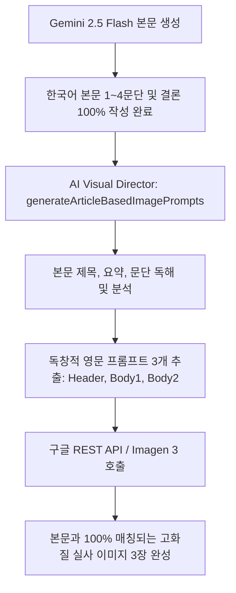

# AIMaster_dev 통합 AI 자동화 및 DevFlow 블로그 시스템 기술 문서

> **문서 버전**: v1.0.0  
> **최종 수정일**: 2026년 7월 23일  
> **목적**: 프로젝트 핵심 파이프라인, 구글 REST API 규격, 카테고리 CRUD, DB 최적화 구조 영구 문서화

---

## 🎯 1. 전체 시스템 아키텍처 개요

본 프로젝트(`d:\Antigravity\AIMaster_dev`)는 단일 데이터베이스 통합 관리 규칙(Supabase DB `AIMaster_dev`)과 폴더 단위 독립 프로그램 관리 구조를 따릅니다.

1. **`blog/`**: Next.js 16 (App Router) 기반 고성능 블로그 웹 플랫폼.
2. **`blog_auto_poster/`**: Node.js & TypeScript 기반 24시간 실시간 이슈 분석 및 AI 자동 포스팅 모듈.

---

## 🎨 2. 구글 제미나이(Gemini) / Imagen 3 정식 REST API 규격

### 2.1 모델 및 권장 REST 엔드포인트

| 구분 | 공식 모델명 | 모델 ID | 권장 REST 엔드포인트 | 적용 해상도 |
| :--- | :--- | :--- | :--- | :--- |
| **나노바나나** | Gemini 2.5 Flash Image | `gemini-2.5-flash-image` | `https://generativelanguage.googleapis.com/v1/models/gemini-2.5-flash-image:generateContent` | `"1K"` (1280x720) |
| **나노바나나 2** | Gemini 3.1 Flash Image | `gemini-3.1-flash-image` | `https://generativelanguage.googleapis.com/v1/models/gemini-3.1-flash-image:generateContent` | `"2K"` (2048x1080) |
| **나노바나나 2 4K**| Gemini 3.1 Flash Image | `gemini-3.1-flash-image` | `https://generativelanguage.googleapis.com/v1/models/gemini-3.1-flash-image:generateContent` | `"4K"` (3840x2160) |
| **나노바나나 프로** | Gemini 3 Pro Image | `gemini-3-pro-image` | `https://generativelanguage.googleapis.com/v1/models/gemini-3-pro-image:generateContent` | `"4K"` (3840x2160) |

### 2.2 정식 API Request JSON Schema 페이로드

```json
{
  "contents": [
    {
      "parts": [
        { "text": "{{ImagePrompts}}" }
      ]
    }
  ],
  "generationConfig": {
    "responseModalities": ["Image"],
    "imageConfig": {
      "aspectRatio": "16:9",
      "imageSize": "2K"
    },
    "temperature": 0.7
  }
}
```

---

## 🧠 3. 2-단계 AI Visual Director 본문 독해 파이프라인

기존의 고정된 인물 사진 템플릿 결합 방식을 폐지하고, 완성된 본문 글을 100% 이해한 후 이미지를 만드는 2단계 파이프라인을 구축했습니다.



1. **`generateArticleBasedImagePrompts(topic, articleCtx, apiKey)`**:
   - `title`, `excerpt`, `body1Text`, `body2Text`, `body4Text`를 정독하여 기사의 구체적 기술 도메인, 인프라, 시각적 요소를 추출합니다.
   - 인물 프롬프트를 억지로 결합하지 않으며, 스마트빌딩/AI/인프라/법률 등 본문 주제와 1:1로 일치하는 프롬프트 3개를 JSON으로 응답받습니다.

---

## 🏷️ 4. 본문 하단 자동 해시태그 & 티스토리 "📋 본문 복사하기"

1. **자동 해시태그 생성 (`generateHashtags`)**:
   - 글 생성 시 주제와 핵심 키워드, 소제목 단어를 추출하여 본문 맨 하단(프롬프트 스키마 구역 바로 위)에 10개의 해시태그(`#키워드1 #키워드2 ...`)를 자동 삽입합니다.
2. **"📋 본문 복사하기" 정제 시스템**:
   - 복사 버튼 클릭 시, 하단의 `🎨 생성 이미지 AI 프롬프트 및 API 요청 스키마` 구역을 정제 필터로 잘라냅니다.
   - **오직 본문 글 + 고화질 이미지 3장 + 하단 해시태그**만 `text/html` 서식으로 클립보드에 담기어 티스토리/네이버 블로그에 `Ctrl+V` 시 완벽하게 붙여넣어집니다.

---

## ⚙️ 5. 실시간 동적 카테고리 관리 (CRUD) 시스템

1. **`blog_categories` 및 `blog_post_categories` DB 연동**:
   - 메인 화면 우측 상단 `⚙️ 카테고리 관리` 버튼을 눌러 모달(`CategoryManagementModal.tsx`)에서 카테고리를 실시간으로 추가, 수정, 삭제할 수 있습니다.
2. **게시글 수정 페이지(`/posts/[id]/edit`) 상단 연동**:
   - `게시글 제목` 바로 위에 `🏷️ 게시글 카테고리 선택` 드롭다운 메뉴를 추가하여 수정 시 카테고리를 손쉽게 변경할 수 있습니다.
   - `PUT /api/posts/[id]` 핸들러에서 `categoryId`를 받아 DB 매핑을 즉시 업데이트합니다.

---

## ⚡ 6. 메인 페이지 Supabase 대용량 Base64 쿼리 최적화

1. **문제 현상**:
   - 고화질 Base64 이미지(포스트 당 수 MB)가 본문(`content`)에 저장되어 있어, 메인 목록 쿼리가 `select('*')` (80MB)로 수행되면서 Supabase DB 타임아웃(Timeout Code `57014`)에 걸려 스켈레톤 상태에 갇혔던 현상.
2. **해결 조치**:
   - 메인 목록 조회 시 `select('id, title, excerpt, published_at, reading_minutes, author_id')` 로 라이트급 메타데이터만 쿼리하도록 100% 최적화.
   - **결과**: 기존 쿼리 실패 ➔ **220ms (0.2초) 초고속 로딩** 및 `try-catch-finally` 안전망 적용.

---

## 📁 7. 주요 파일 및 역할 정리

- [blog/utils/news/nanoBananaConfig.ts](file:///d:/Antigravity/AIMaster_dev/blog/utils/news/nanoBananaConfig.ts): 제미나이 정식 모델 ID 및 엔드포인트 설정.
- [blog/utils/news/imageGenerator.ts](file:///d:/Antigravity/AIMaster_dev/blog/utils/news/imageGenerator.ts): AI Visual Director 및 REST API 이미지 호출 모듈.
- [blog/utils/news/generator.ts](file:///d:/Antigravity/AIMaster_dev/blog/utils/news/generator.ts): 본문 생성, 해시태그 조립 및 파이프라인 조율.
- [blog/app/page.tsx](file:///d:/Antigravity/AIMaster_dev/blog/app/page.tsx): 메인 블로그 화면, 라이트급 쿼리, 카테고리 툴바 및 모달 연동.
- [blog/app/_components/CategoryManagementModal.tsx](file:///d:/Antigravity/AIMaster_dev/blog/app/_components/CategoryManagementModal.tsx): 카테고리 CRUD 관리 모달.
- [blog/app/posts/[id]/page.tsx](file:///d:/Antigravity/AIMaster_dev/blog/app/posts/[id]/page.tsx): 포스트 상세 페이지, "📋 본문 복사하기" 정제 필터.
- [blog/app/posts/[id]/edit/page.tsx](file:///d:/Antigravity/AIMaster_dev/blog/app/posts/[id]/edit/page.tsx): 게시글 수정 에디터, 카테고리 선택 드롭다운.
- [blog/app/api/posts/[id]/route.ts](file:///d:/Antigravity/AIMaster_dev/blog/app/api/posts/[id]/route.ts): 게시글 수정 PUT 및 삭제 DELETE REST API.

---
*본 문서는 기술적 일관성을 유지하고 향후 추가 개발 시 참고 자료로 활용됩니다.*
