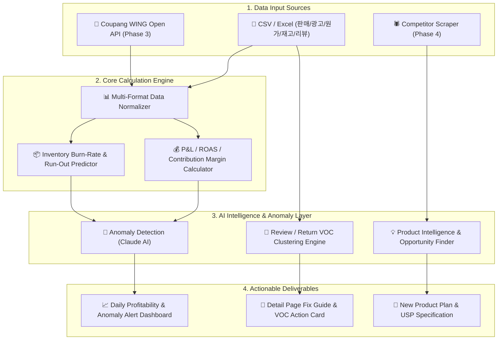

# 🏗️ Coupang Seller Copilot — 상세 아키텍처 및 알고리즘 명세서 (ARCHITECTURE.md)

## 1. 전체 아키텍처 흐름도 (Overall Architecture)



---

## 2. 모듈별 세부 알고리즘 및 데이터 설계

### 2.1 통합 데이터 스키마 (Unified Data Schema)
```typescript
interface ProductMetric {
  sku_id: string;
  product_name: string;
  sales_amount: number;       // 총 매출액
  sales_volume: number;       // 판매 수량
  ad_spend: number;           // 집행 광고비
  roas: number;               // (sales_amount / ad_spend) * 100
  cpa: number;                // ad_spend / sales_volume
  cogs: number;               // 원가 (Cost of Goods Sold)
  platform_fee: number;       // 쿠팡 수수료
  shipping_cost: number;      // 택배/물류비
  contribution_margin: number; // 공헌이익
  margin_rate: number;        // 공헌이익률 (%)
  current_stock: number;      // 현재 재고
  daily_sales_rate: number;   // 최근 N일 일평균 판매수량
  runout_days: number;        // 재고 소진 예상일
}
```

### 2.2 Claude AI 이상 징후 감지 (Anomaly Detection Prompt Logic)
* **트리거 규칙 (Anomaly Trigger Rules)**:
  1. `ROAS Drop`: 최근 7일 평균 ROAS 대비 당일/최근 3일 ROAS가 15% 이상 하락 시.
  2. `Ad Efficiency Decay`: 광고비 지출 상승 비율 대비 매출 성장 비율이 1/3 이하인 경우.
  3. `Stockout Alert`: `runout_days` <= 20일 이하 (리드타임 고려 경고).
  4. `Low Margin Warning`: `margin_rate` < 목표 공헌이익률(예: 15%).
* **Claude 프롬프트 템플릿**:
  ```text
  당신은 수석 이커머스 CFO 및 운영 컨설턴트입니다.
  제공된 [ProductMetrics JSON] 데이터를 기반으로, 셀러가 당장 조치해야 할 이상 징후(Anomaly) 상위 3~5개를 직관적인 요약 및 실행 권장사항과 함께 제안하세요.
  ```

### 2.3 VOC 불만사항 NLP 클러스터링 & 상세페이지 개선안
* **분석 알고리즘**:
  1. 리뷰 1~3점 및 반품 사유 텍스트 수집.
  2. TF-IDF 및 LLM Embeddings 기반 불만 키워드 카테고리화 (예: `사이즈 작음`, `내구성 불량`, `설명서 부족`, `색상 차이`).
  3. 불만 비율이 높은 이슈 탑 3 추출 ➔ 상세페이지 내 **Q&A 섹션 추가, 사이즈 안내 표 보완, 사용법 주의사항 강조** 등 구체적 카피라이팅 자동 생성.

### 2.4 Product Intelligence (경쟁사 분석 및 신제품 기획서)
* **작동 프로세스**:
  1. 타겟 카테고리 Top 20 경쟁 상품의 리뷰/스펙 데이터 파싱.
  2. **Unmet Needs Matrix**: 경쟁 상품들이 해결해주지 못하는 고객 페인포인트(Pain Points) 도출.
  3. **신제품 포지셔닝 제안**: 차별화 USP(Unique Selling Proposition), 예상 마진 구조, 썸네일/상세페이지 훅 기획서 자동 작성.
