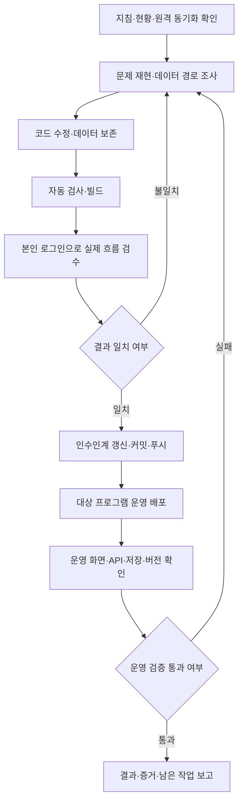

# AI 에이전트 기반 자율 개발·검수·배포

> **공식 명칭:** AI 에이전트 기반 자율 개발·검수·배포
> **주인님 명명·공통 지침 지정:** 2026-10-10
> **적용 범위:** AIMaster 및 모든 서브프로그램, Codex·Claude Code·Gemini 등 인수받는 모든 CLI
> **사례 기준:** `naver-blog-agent` v1.58~v1.62의 실제 작업과 검수 기록

이 문서는 메인 개발 방식의 공통 실행 지침이자 인수인계 문서입니다. AI 에이전트가 사용자의 승인된 작업 범위에서 조사·구현·오류 수정·검수·문서화·커밋·푸시·운영 배포·배포 후 확인·보고를 연결해 수행하는 방식을 정의합니다. 실제 사용자가 이용하는 경로의 결과를 증거로 확인해야 작업이 완료됩니다.

**우선순위:** 시스템·실행 환경 제약과 주인님의 명시적 지시를 따릅니다. 저장소의 본인 계정·본인 API 최상위 규칙 및 이미 정해진 승인 범위는 그대로 적용합니다. 이 문서는 권한을 새로 부여하거나 기존 특수 작업·클라우드 제한을 해제하지 않습니다. 관련 원문은 [AGENTS.md](../AGENTS.md), [CLAUDE.md](../CLAUDE.md), [본인 계정·API 규칙](TOP_RULE_PERSONAL_ACCOUNT_API.md), [클라우드 세션 규칙](CLOUD_SESSION.md)입니다.

## 1. 방식의 정의와 적용 범위

에이전트는 코드를 작성하고 설명하는 데서 멈추지 않습니다. 기존 코드·문서·로그·실제 화면을 대조해 원인을 찾고, 필요한 수정과 검사를 실행한 다음 결과물을 운영 환경에 반영하고 확인합니다. 구현 방식·파일 위치·검사 표본·커밋 메시지 등 통상적인 선택은 기존 구조와 안정성을 기준으로 결정합니다.

이 방식은 **에이전트가 도구를 직접 실행하는 개발**, **실제 사용 경로를 확인하는 E2E 검수**, **커밋부터 운영 검증까지 이어지는 배포 절차**를 결합합니다. 여기서 E2E는 웹 화면→API→데이터→확장/외부 편집기→사용자에게 보이는 결과까지 연결해서 확인하는 검사입니다. 프로그램에 확장이 없으면 해당 구간을 생략하고 실제 연동 서비스의 결과를 확인합니다.

검사 스크립트나 CI가 있다는 사실과 이 개발 방식은 구분합니다. 이번 네이버 작업에서는 에이전트가 CLI 명령을 직접 실행했습니다. 새 GitHub Actions 파이프라인을 구축하거나 완전한 무인 운영을 증명한 것은 아닙니다. PC 화면 제어도 그 세션에서 제공된 도구·접근 권한을 사용한 것이며, 모든 CLI에 영구 제어 권한이 생기는 것은 아닙니다.



운영 도메인 전용 연결처럼 로컬에서 전체 흐름을 재현할 수 없는 구간은 사전 검사를 거쳐 배포한 뒤 운영 환경에서 확인합니다. 이러한 항목은 배포 전 검수 완료로 표시하지 않습니다. 실패하면 원인을 수정하고 다시 검수·릴리스합니다.

## 2. 새 CLI가 시작할 때 읽을 순서

1. 루트 [AGENTS.md](../AGENTS.md) 및 [CLAUDE.md](../CLAUDE.md)의 최상위 규칙과 작업 자율성 지침.
2. [HANDOFF.md](HANDOFF.md)의 최신 상태·미완료 항목. 과거 항목과 최신 확정 결과를 구분합니다.
3. [TOP_RULE_PERSONAL_ACCOUNT_API.md](TOP_RULE_PERSONAL_ACCOUNT_API.md), [ERROR_LESSONS.md](ERROR_LESSONS.md).
4. 이 문서, 대상 `<프로그램>/AGENTS.md`·`README.md`·`docs/CONTINUATION.md` 등 실제 존재하는 인수인계 문서.
5. 작업에 따라 [PLATFORM_PATTERNS.md](PLATFORM_PATTERNS.md), [SIDEBAR_LAYOUT_STANDARD.md](SIDEBAR_LAYOUT_STANDARD.md), [EXTENSION_RELEASE_RULES.md](EXTENSION_RELEASE_RULES.md), [DOMAIN_SSO_POLICY.md](DOMAIN_SSO_POLICY.md).
6. 필요한 도구의 현재 스킬/사용 지침. 세션에 없는 도구·권한·인증을 있다고 가정하지 않습니다.

다른 CLI에 작업을 넘길 때 시작 요청 예시:

```text
이 저장소는 "AI 에이전트 기반 자율 개발·검수·배포" 방식을 사용합니다.
AGENTS.md와 docs/HANDOFF.md, docs/AI_AGENT_AUTONOMOUS_DEV_WORKFLOW.md,
대상 프로그램의 인수인계 문서를 읽고 최신 커밋·미완료 작업을 확인하세요.
승인된 범위에서 구현→검수→문서화→커밋→푸시→배포→운영 검증→보고까지 진행하세요.
실제로 검사하지 않은 항목은 통과로 표시하지 말고 재개 조건을 남기세요.
대상 프로그램과 요청 작업: <이번 작업 내용>
```

로컬 작업 폴더·브랜치·원격·최근 커밋을 확인합니다. 아래 명령은 **저장소 루트에서** 실행합니다.

```powershell
Get-Location
git status --short
git branch --show-current
git remote -v
git log --oneline -10
git fetch origin
git rev-list --left-right --count HEAD...origin/master
```

마지막 출력의 왼쪽은 로컬에만 있는 커밋, 오른쪽은 원격에만 있는 커밋 수입니다. `0 0`일 때 동기화 상태입니다. 숫자가 다르면 차이를 읽고 현재 작업을 보존하면서 통합합니다. 다른 CLI의 변경을 덮어쓰거나 임의로 `reset --hard`·force-push하지 않습니다. 클라우드 세션은 `cloud-work` 규칙을 적용하며 위의 master 비교를 로컬 배포 권한으로 해석하지 않습니다.

## 3. 실제 사용한 도구와 선택 기준

| 역할 | 네이버 작업에서 사용한 도구 | 다른 프로그램에 적용할 때 |
|---|---|---|
| 조사·구현·실행 조정 | Codex, 실행 도구 `exec_command`/`apply_patch` | 인수 CLI의 동등한 파일 편집·명령 실행 기능을 사용합니다. |
| 코드·문서 검색 | PowerShell, `rg`·`rg --files`, Git | 검색 범위를 먼저 정하고 관련 파일을 묶어 읽습니다. |
| 웹 구현 | 기존 Next.js·React·TypeScript·Tailwind 구조 | 이 방식 때문에 프레임워크를 교체하지 않습니다. |
| 자동 검사 | Node.js 검사 스크립트, TypeScript 빌드, ESLint | 대상 프로그램의 `package.json`과 기존 검사부터 확인합니다. |
| 네이버 입력 실행 | 자체 Manifest V3 Chrome 확장 | 회원 본인의 로그인 세션으로 작동하는 기존 연동 엔진을 사용합니다. |
| 실제 화면 제어 | Orca `computer-use` | 가시적인 앱/브라우저 조작이 필요하고 사용 가능한 경우에만 사용합니다. |
| 내부 상태·실제 연결 검사 | Chrome DevTools, 확장 서비스 워커, `chrome.scripting.executeScript` | 허용된 자체 앱·대상 서비스·본인 데이터만 검사합니다. |
| 저장·보존·버전 확인 | Supabase 연결 도구의 SQL 실행 | 해당 DB 스킬을 읽고 권한·스키마 승인 범위를 확인합니다. |
| 커밋·원격 동기화 | Git | 다른 CLI의 파일이 섞이지 않도록 명시적으로 경로를 선택합니다. |
| 운영 배포 | Vercel CLI | `.vercel/project.json`의 프로그램·팀을 확인하고 해당 폴더에서 실행합니다. |
| 배포 결과 확인 | HTTP 요청, ZIP 내용 검사, SHA256 비교 | 운영 별칭과 실제 배포 자산을 직접 확인합니다. |

파일·Git·CLI·HTTP로 처리할 수 있는 일은 그 경로를 우선 사용하고, 화면이 필요한 일에는 실제 화면 제어를 사용합니다. 네이버 사례의 브라우저 검수는 **주인님이 연 실제 Chrome**에서 진행했으며 Playwright·별도 헤드리스 브라우저를 사용하지 않았습니다. 다른 프로그램에서도 같은 도구를 무조건 설치해야 한다는 뜻은 아닙니다. 대체 도구를 쓰면 검사 환경·로그인 방식·증거를 명시하고 동일한 검수 기준을 만족해야 합니다.

## 4. 권한·자율 실행의 경계

일반 기능 요청은 필요한 조사·구현·저위험 수정·파일 생성·의존성 처리·빌드·검수·문서화·커밋·푸시·프로덕션 배포 권한으로 해석합니다. 이미 승인받은 범위는 반복 확인하지 않습니다. 같은 작업 세트 안에서 발견한 오류는 수정하고 재검수합니다.

다음은 기존 메인 지침에 따라 사전 승인이 필요한 범위입니다. 승인받은 구체적 범위가 있으면 그 범위를 적용합니다.

| 작업 | 처리 기준 |
|---|---|
| 파괴적 데이터 삭제·force-push | 명시적 승인 범위 확인 후 진행 |
| 비밀번호·API 키 변경 | 명시적 승인 필요, 비밀값 노출 금지 |
| 환경변수·DB 스키마 변경 | 구체적인 변경 내용을 준비하고 승인 범위 확인 |
| 유료 API 대량 호출 | 비용·호출량 범위 승인 필요 |
| 회원 대신 최종 발행·결제·외부 콘텐츠 공개 | 해당 외부 행위에 대한 명시적 승인 필요 |

프로그램 프로덕션 배포와 회원의 블로그 글 최종 발행은 서로 다른 행위입니다. 개발 요청에 포함된 프로그램 배포 승인을 블로그 발행 승인으로 확대하지 않습니다. 검사하기 위해 발행 큐에 글을 넣으면 확장이 최종 발행까지 진행할 수 있으므로, 발행 승인 없는 검수는 큐 등록을 피하고 입력·설정·저장 검사 경로를 사용합니다.

클라우드 CLI는 [CLOUD_SESSION.md](CLOUD_SESSION.md)에 따라 브랜치 작업·문서 인수인계까지만 수행하고, 버전 갱신·운영 DB 쓰기·배포·실제 PC 검수는 로컬로 넘깁니다. 도구가 접근을 거절하면 우회하지 않고 허용된 대체 경로를 찾습니다. 실제 접근이 없으면 해당 검수를 미완료로 기록합니다.

## 5. 원인을 조사하고 구현하는 방법

1. 사용자가 기대한 결과, 관찰된 증상, 발생 위치를 먼저 구체화합니다. 예: 이미지 4장을 전송했는데 대표 사진이 두 번 들어가고 첫 본문에서 멈춤.
2. 코드 경로 전체를 추적합니다. 생성/편집 데이터→서버 저장→전송 payload→자산 파일→입력 순서→외부 편집기 반영→검증 결과 순서입니다.
3. 기존 성공 코드·문서·실패 로그·실제 저장된 값을 비교합니다. 화면에 보인 값과 DB 값을 같은 것으로 가정하지 않습니다.
4. 사용자 데이터를 보존하는 최소 수정으로 원인을 해결합니다. 기존 원고를 일괄 변환해야 한다면 먼저 영향 범위와 별도 승인 필요 여부를 확인합니다.
5. API의 기존 소비자와 옛 확장의 호환성을 유지합니다. 새 메타데이터는 기존 정보가 손실되지 않도록 추가합니다.
6. 상태 전환·동시 실행·재시도·지연된 화면 갱신을 함께 검토합니다. 반복해서 눌렀을 때 생기는 중복도 확인합니다.

네이버 사례에서는 기존 DB 원고를 덮어고치는 대신 전송 변환을 보완했고, 새 카테고리 설정은 기존 `research_summary`의 다른 정보를 보존하며 추가했습니다. 실험용 원고는 별도로 생성했으며 기존 실패 원고의 상태까지 유지했습니다.

## 6. 로그인·소유자·키 검수

- 실제 기능 검사에는 일반 회원과 같은 권한의 시험 계정 `buylifemall@naver.com`을 사용했습니다. 관리자 계정으로 성공한 결과만으로 일반 회원 동작을 판정하지 않습니다.
- 페이지뿐 아니라 쓰기 API/Server Action에서도 로그인·프로그램 이용 권한을 검사합니다. 서비스 권한 DB 클라이언트를 쓰더라도 행의 `user_id`를 명시적으로 한정합니다.
- 웹 회원·확장 연결 회원·외부 플랫폼 대상 계정이 일치해야 합니다. 웹이 보낸 회원 ID만 신뢰하지 않고 서버가 인증한 연결 소유자와 대조합니다.
- 회원의 본인 키·본인 계정만 사용합니다. 미등록 키를 관리자/다른 회원 키로 대신 처리하지 않습니다. 네이버 v1.61~v1.62 검사에서는 기존 원고·이미지를 재사용했으며 새 유료 AI 생성 호출을 하지 않았습니다.
- 토큰·비밀번호·API 키를 콘솔 출력·보고·문서·스크린샷·커밋에 포함하지 않습니다. 인증 확인 시 회원 일치 여부·HTTP 상태·검사 결과 등 필요한 최소 정보만 기록합니다.
- 인증이 필요한 기능을 Supabase 관리자 SQL로 대신 처리한 뒤 실제 회원 API 검수에 통과했다고 보고하지 않습니다. SQL은 저장 결과·지문·버전 확인 등의 증거로 사용하고 실제 경로는 회원 세션으로 검사합니다.
- 비로그인, 다른 회원 원고, 대상 블로그 불일치, 대기/발행 중 수정, 저장 조회 사이 상태 변경 등 중요한 경계를 검사합니다. 실행하지 않은 경계는 검사 완료로 기재하지 않습니다.

## 7. 검사 단계와 통과 증거

| 단계 | 확인할 내용 | 완료 근거 |
|---|---|---|
| 코드 검토 | 소유자·권한·기존 데이터·상태 전환·호환성 | 변경 파일 검토와 관련 코드 위치 |
| 자동 검사 | 재현 가능한 원인, 중복·동시 전환·보존 조건 | 실제 실행 명령과 종료 결과 |
| 타입·빌드·린트 | 컴파일, 타입, 변경 범위의 오류 | 빌드 종료 코드, 오류/경고 구분 |
| 실제 화면 | 회원의 클릭·입력·배치·저장·재조회 | 실제 로그인 화면, DOM 결과, 필요한 스크린샷 |
| 데이터 보존 | 대상 원고의 본문·이미지·상태 | 변경 전후 값/개수/지문 비교 |
| 운영 배포 | 지정 프로젝트·팀·프로덕션 READY·별칭 | 배포 ID·READY·라이브 URL |
| 운영 흐름 | 배포된 API·브리지·외부 결과·저장 복원 | 운영 도메인에서 다시 확인한 결과 |
| 확장 릴리스 | 소스·DB·manifest·ZIP·설치 상태 | 버전 일치, ZIP 200, 필요 시 해시 비교 |

자동 검사 통과는 실제 외부 편집기 성공을 증명하지 않습니다. HTTP 200은 기능 정상 동작을 단독으로 증명하지 않습니다. 버튼 클릭 도구가 성공해도 목표 값이 반영됐는지 다시 읽습니다. 해당 시점의 스크린샷은 현재 화면의 증거이며, 저장 후 복원 여부는 별도로 확인합니다.

의미 있는 위험·원인·경계에 대한 기존 검사를 우선합니다. 단순 문서·색상·배치 변경에 구현 내용을 그대로 따라 쓰는 새 테스트를 무조건 만들지 않습니다. 실패나 추가 수정이 생겼을 때 관련 검사를 다시 실행하며, 원인 없는 반복 전체 검사는 피합니다. 기존 오류/경고와 새 오류/경고를 구분해 보고합니다.

## 8. 실제 Chrome·Orca 검수 절차

이 절의 명령은 **Orca가 제공된 Windows 로컬 환경의 예시**입니다. 설치 여부와 세션 지침을 먼저 확인합니다. 다른 CLI에서는 사용 가능한 대응 도구를 쓰거나 미검수 항목을 인수인계합니다.

1. `computer-use` 스킬을 읽고 현재 세션의 Orca 실행 파일을 확인합니다. 환경 변수/개발 환경에 따라 `orca-dev` 등 다른 실행 파일일 수 있으므로 이름을 고정하지 않습니다.
2. 주인님이 로그인한 대상 Chrome과 작업 도메인을 확인합니다. 무관한 탭·개인정보는 읽지 않습니다.
3. 접근성 트리와 스크린샷으로 창·버튼·입력란을 식별합니다. GUI 제어가 필요한 경우 다음 순서를 사용합니다.

```powershell
# 이 사례에서 사용한 실행 파일은 orca였습니다.
orca skills get computer-use --json
orca computer capabilities --json
orca computer list-windows --app chrome --json
# 반환된 현재 창 ID를 사용합니다. 아래 값은 예시 자리표시자입니다.
orca computer get-app-state --app chrome --window-id <현재창ID> --json
orca computer click --app chrome --window-id <현재창ID> --element-index <현재버튼번호> --json
```

4. 작업 후 새 상태에서 버튼 번호를 다시 읽습니다. 창 ID·탭 ID·접근성 번호는 실행 중 바뀌므로 과거 보고서나 임시 스크립트의 값을 그대로 재사용하지 않습니다.
5. 입력에는 접근성 `set-value`, 클릭에는 의미 있는 요소 선택을 우선합니다. 코드/여러 줄 텍스트는 UTF-8 파일이나 적절한 stdin 경로로 전달하고, 셸의 백틱·`$()` 등이 실행되지 않도록 합니다.
6. DevTools/자체 확장 내부 검사에서는 실제 코드 경로의 입력과 결과를 확인합니다. `chrome.scripting.executeScript`의 결과가 `null`이면 통과로 간주하지 않습니다. 예외·페이지 이동·프레임 선택·로그인 상태 등을 구분하고 오류를 명시적으로 반환해 진단합니다.
7. DevTools가 커졌거나 로그가 많으면 필요한 내용만 출력하고 콘솔을 정리합니다. 대량 DOM/전체 payload/인증 저장소를 통째로 출력하지 않습니다.
8. `window_not_found`·`element_not_found`는 현재 창/요소를 다시 찾습니다. `window_not_focused`는 지침이 허용한 한 번의 복구 후 확인합니다. 접근 거절이나 화면 제어 불능을 같은 명령으로 반복하지 않습니다.
9. 좌표 클릭이 필요하면 최신 스크린샷과 `scale`을 확인하고 창 기준 좌표로 변환합니다. 입력·클릭의 도구 메타데이터가 `unverified`이면 화면/DOM의 실제 반영을 별도로 확인합니다.
10. 기존 사용자의 원고 탭을 재활용해 덮어쓰지 않습니다. 새 검수 원고·새 편집기에서 원고가 비어 있는지 안정적으로 확인하고 시작합니다.

실제 네이버 시험에서는 기존 내용이 있으면 중지하고, 이어쓰기 창 처리 뒤 2초간 빈 편집기를 반복 확인했습니다. 작성만 검사하는 `writeArticle()`과 최종 발행하는 `publish()`를 분리해 발행 없이 실제 입력을 검수했습니다.

## 9. 네이버 사례에서 확정한 구현·검수 원칙

### 9.1 이미지·본문 입력

- 대표 이미지와 본문 이미지를 구분하고 최종 원고에서 전체 이미지 개수를 검사합니다.
- URL 중복 제거 후 자산 파일명과 writer 검증 이름을 같은 값으로 사용합니다. 업로드된 파일 이름과 입력 계획 이름을 함께 대조합니다.
- 이미지 업로드가 비동기인 경우 시간 초과만으로 재업로드하지 않습니다. 첫 업로드가 나중에 완료되면 중복 이미지가 생길 수 있습니다. 현재 결과를 검사하고 불명확하면 중지합니다.
- 입력 후 전체 본문·캡션·마지막 문장·인용구를 확인합니다. 일부 텍스트만 보이는 것을 성공으로 간주하지 않습니다.
- 네이버에서 실제 발견한 이모지 뒤 텍스트 소실은 복합 이모지의 글자 묶음을 보존해 일반 텍스트와 별도로 입력하도록 수정하고 전체 원문 검증으로 확인했습니다.

### 9.2 카테고리·태그·저장

- 웹의 글감 분류와 외부 플랫폼의 실제 발행 카테고리는 별도 값입니다. 해당 회원의 실제 목록을 조회하고 원고별 ID/이름을 저장합니다.
- 네이버는 원고별 설정을 블로그 기본값보다 우선합니다. 기존 `research_summary.naver_publishing`, `nba_posts.tags`, `nba_accounts.default_category`를 사용했고 DB 스키마를 변경하지 않았습니다.
- 카테고리가 삭제/개명됐거나 이름만으로 구분할 수 없으면 임의의 다른 카테고리로 발행하지 않습니다.
- 태그는 입력창이 비워졌다는 사실과 실제 등록된 칩을 함께 확인합니다. 기존 태그 보존·요청 태그 등록·재적용 시 중복 없음이 검수 기준입니다. 앱의 자동 등록 태그 상한은 10개이며, 네이버 전체 태그 제한과 혼동하지 않습니다.
- 설정 저장 API는 소유자 및 대기/발행 중 상태를 검사합니다. 조회 뒤 상태가 바뀌는 경우도 조건부 갱신으로 막습니다.
- 수정한 설정과 입력 중인 태그가 남아 있으면 설정 화면의 전송을 차단하고 저장 후 해제합니다. 웹 재조회 및 새로고침 복원까지 확인합니다.
- 공통 `busy`를 실제 발행 작업과 주기 상태 확인이 공유할 때 구분이 필요합니다. v1.62는 상태 확인 종료를 최대 10초 기다린 후 조회 잠금을 잡되 실제 `activeTask`가 있으면 즉시 차단합니다.
- 설정 조회 브리지는 자체 운영 도메인에 한정합니다. 연결 토큰을 웹으로 노출하거나 조회 브리지에 원고 작성/최종 발행 명령을 추가하지 않습니다.

### 9.3 실제 확인한 범위와 한계

| 기록 | 실제 결과·증거 |
|---|---|
| v1.58 화면 개선 | 버튼 오른쪽 정렬, 파란 저장 버튼·흰 글자 실제 확인 |
| v1.59 이미지 수정 | 대표 중복·본문 한 칸 밀림·파일명 불일치 수정, 기존 실패 원고 변환에서 고유 이미지 4개 확인 |
| v1.60 입력 검수 | 실제 Chrome 32/32 단계, 이미지 4장·중복 0, 인용구 5개, 전체 원고·마지막 문장 일치 |
| v1.61~v1.62 설정 검수 | 실제 카테고리 13개, `●AI자동화` ID29, 태그10개·재적용10개, 운영 웹 저장/새로고침 복원 및 네이버 재적용 통과 |
| 보존 검사 | 기존 원고와 별도 검수 원고의 본문·이미지 MD5 동일, 이미지 4장, 기존 상태 유지 |
| 운영 릴리스 | 최종 v1.62 배포 `dpl_4uqhK9tSxbr1nvk62keN9jUdFLjq` READY, DB/확장/라이브 ZIP 일치·200·핵심5파일 SHA256 일치 |
| 외부 최종 발행 | 실행하지 않음. 발행 완료·네이버 전체 정책/환경 호환성을 증명한 검수로 확대하지 않음 |

MD5는 이 사례에서 **변경 전후 동일 여부 비교**에만 사용했습니다. 보안 서명이나 암호화 검증으로 해석하지 않습니다. 릴리스 파일 비교에는 SHA256을 사용했습니다.

카테고리 13개·ID29·태그10개·입력32단계·이미지4장은 그 시험 원고/블로그의 관찰값입니다. 다른 프로그램이나 회원에게 그대로 요구되는 고정값이 아닙니다. 해당 작업의 기대값을 먼저 정의합니다.

세부 증거·커밋·검수 원고는 [네이버 실제 검수 보고](../naver-blog-agent/docs/CATEGORY_TAG_VERIFICATION_2026-10-10.md), [인수인계](../naver-blog-agent/docs/CONTINUATION.md), [프로그램 AGENTS](../naver-blog-agent/AGENTS.md)에 있습니다. 개별 이미지 자동 저장 누락·저장 성공 배지·임시 ID 전환 중 중복 원고 가능성 등 이전에 기록된 후속 문제는 이 방식 명명이나 카테고리·태그 작업으로 해결된 것이 아닙니다. 최신 HANDOFF에서 별도로 추적합니다.

## 10. 다른 프로그램으로 옮길 때 참고할 코드

| 목적 | 네이버 코드/검사 위치 |
|---|---|
| 입력과 최종 발행 분리, 작업 잠금 | `naver-blog-agent/extension/background.js`의 `writeArticle()`·`publish()`·`pump()`·categories 처리 |
| 실제 편집기 조작·입력 후 검증 | `naver-blog-agent/extension/editor.js`의 `editorCommand()` |
| 입력 계획·중복 업로드 방지 | `naver-blog-agent/extension/article-plan.js`, `writer.js` |
| 원고→확장 payload 변환 | `naver-blog-agent/src/lib/extensionBridge.ts`의 `buildBridgePayload()` |
| 카테고리·태그 데이터 처리 | `naver-blog-agent/src/lib/naverPublishing.ts` |
| 회원 웹↔확장 조회 연결 | `src/lib/naverExtensionClient.ts`, `extension/web-bridge.js` |
| 설정 UI 및 원고 소유자 저장 | `src/components/NaverPublishSettings.tsx`, `src/app/api/posts/[id]/publishing/route.ts` |
| 연결 소유자·작업 조회 | `src/app/api/extension/status/route.ts`, `task/route.ts` |
| 자동 회귀 검사 | `scripts/test-extension-bridge.cjs`, `test-naver-publishing.cjs`, `test-edited-post-save.cjs` |
| 확장 ZIP 생성 | `scripts/build-extension-archive.mjs`, `package.json`의 `prebuild` |
| 전체 공통 확장 릴리스 확인 | 루트 `scripts/check-extension-release.mjs <slug>` |

표의 `src/`·`extension/`·`scripts/` 단축 경로는 마지막 공통 검사 행을 제외하고 `naver-blog-agent/` 기준입니다. 데이터 경계·입력 후 검증·상태 전환·UI 동작을 참고하되, 네이버 전용 DOM 선택자·블로그 ID·호스트 권한·테이블명까지 다른 서비스에 그대로 복사하지 않습니다. 기존 공통 권한·키 관리·흰색 작업 화면·사이드바 표준을 재사용합니다.

## 11. 빌드·검사 명령과 결과 기록

검사 이름은 프로그램마다 다릅니다. `package.json`을 먼저 읽습니다. 다음은 **네이버 프로그램 폴더에서 실제 사용한 명령**입니다.

```powershell
npm run test:extension
npm run test:publishing
npm run test:edit-save
npm run build
node --check extension/background.js
node --check extension/editor.js
node --check extension/web-bridge.js
```

변경 파일에 필요한 ESLint 검사를 실행하고 `git diff --check`로 변경 공백 문제를 확인합니다. 검수 기록에는 명령·실행 위치·결과·오류/경고·검사 대상 버전을 남깁니다. 셸에서 여러 명령을 실행할 때 실패 후 다음 단계로 넘어가지 않도록 종료 코드를 확인합니다. 예를 들어:

```powershell
npm run build
if ($LASTEXITCODE -ne 0) { throw '빌드 실패: 배포를 진행하지 않습니다.' }
```

빌드 통과는 회원 권한·저장·실제 외부 편집기 검사와 별도입니다. 계정 데이터 보존은 대상 행의 본문·이미지·상태를 비교하고, 승인되지 않은 삭제나 무관한 회원 데이터 조회를 하지 않습니다.

**타입 검사 생략 설정도 확인합니다.** 빌드 로그가 `Skipping validation of types`라고 표시하거나 Next.js 설정이 타입 오류 무시를 활성화한 경우, 빌드 성공을 타입 검사 통과로 보고하지 않습니다. 코드 변경에 필요한 별도 타입 검사가 있으면 실행하고 기존 오류와 신규 오류를 구분합니다. 2026-10-10 이 공통 지침 문서 작업의 루트 앱 빌드는 성공했지만 기존 설정 때문에 타입 검사를 생략했습니다. 문서 작업에서 설정을 변경하거나 타입 오류가 없다고 주장하지 않았습니다.

## 12. 커밋·푸시·프로덕션 배포

### 12.1 릴리스 준비

- 수정한 프로그램의 `APP_VERSION`을 `v1.01` 형식으로 마이너 +0.01 올리고 해당 DB `programs.version`과 맞춥니다. 메이저 변경은 주인님 지시가 있을 때만 합니다.
- 확장 프로그램이 있으면 manifest·고정 최신 다운로드 ZIP·DB `extension_version`·`extension_download_url`까지 같은 릴리스로 맞춥니다. 프로그램별 예외는 [EXTENSION_RELEASE_RULES.md](EXTENSION_RELEASE_RULES.md)를 따릅니다.
- 버전/DB SQL 파일은 해당 프로그램의 `supabase/migrations/` 안에 남깁니다. 버전 메타데이터 갱신과 DB 스키마 변경을 구분합니다. 스키마 변경 승인 없이 테이블/정책을 바꾸지 않습니다.
- 인수인계와 에러 교훈은 커밋 전에 갱신합니다. 배포 후에만 알 수 있는 ID·운영 검사 결과는 후속 문서 커밋으로 마감할 수 있습니다.
- 순수 문서 작업은 실제 수정한 코드·프로그램 버전이 없음을 명시합니다. 기능이 바뀌지 않은 프로그램의 버전·DB·확장을 임의로 변경하지 않습니다. 문서 작업의 배포 범위도 기존 사용자 지시와 실제 변경된 프로젝트를 따릅니다.

### 12.2 커밋·푸시

저장소 루트에서 `git diff`·`git status`로 대상 경로를 확인합니다. 여러 CLI가 스테이징을 공유하므로 커밋 직전에 본인 파일만 `git add -- <명시적 파일 경로>`로 넣고 `git diff --cached --name-only`를 확인한 뒤 바로 커밋합니다. `git add .`로 다른 CLI 작업을 섞지 않습니다. 이미 다른 파일이 스테이징돼 있으면 무단으로 해제/포함하지 않고 조정합니다.

로컬 표준 순서는 `git commit`→`git push origin master`입니다. 실패한 push를 완료로 보고하지 않습니다. 원격 변경이 생기면 차이를 조사해 기존 작업을 보존하며 통합하고 재검수합니다. 클라우드는 `cloud-work` 예외를 따릅니다.

### 12.3 배포

`.vercel/project.json`의 프로젝트 이름·팀과 현재 배포 폴더가 맞는지 확인합니다. 서브프로젝트는 해당 폴더에서, 메인 AIMaster는 루트에서 실행합니다. 본 사례의 팀은 `buylife`입니다.

여러 CLI가 작업 폴더를 공유하고 무관한 미커밋/임시 파일이 있으면 배포 입력에 섞이지 않게 확인합니다. 필요한 경우 배포할 커밋의 별도 Git worktree를 만들어 같은 저장소의 확정된 파일만 배포합니다. 대상의 `.vercel/project.json` 연결 정보만 복사하고 인증 비밀·무관한 임시 데이터는 옮기지 않습니다. 새 독립 프로그램/저장소를 만드는 것이 아니라 같은 저장소의 배포 작업 복사본입니다. 작업 복사본 경로·커밋·프로젝트를 기록합니다.

```powershell
# 대상 프로그램 폴더에서 실행. Windows에서는 vercel.cmd를 사용할 수 있습니다.
vercel deploy --prod --yes --scope buylife
```

푸시만으로 배포가 이뤄졌다고 가정하지 않습니다. 이 저장소에는 CLI 업로드 방식의 Vercel 프로젝트가 있습니다. 배포 결과의 프로젝트·`target: production`·`readyState: READY`·배포 ID·운영 별칭을 확인합니다. `Not authorized`가 나면 해당 프로젝트와 팀을 대조하고 올바른 스코프를 사용합니다. 인증·환경변수·키를 임의로 교체하지 않습니다.

### 12.4 배포 후 검사

1. 임시 배포 URL과 실제 운영 주소가 목표 릴리스를 가리키는지 확인합니다.
2. 공개 페이지/API의 HTTP 상태 및 필요한 버전 응답을 확인합니다.
3. 로그인 필요 페이지의 307/302만 보고 기능 정상으로 결론 내리지 않습니다. 실제 회원 로그인으로 변경한 경로를 확인합니다.
4. 사용자별 API는 인증·캐시·저장 결과를 확인합니다. 한 요청의 `X-Vercel-Cache` 값만으로 모든 회원의 캐시 격리가 증명됐다고 보고하지 않습니다.
5. DB 버전 갱신이 필요한 릴리스는 준비한 SQL로 반영하고 코드·운영 화면·DB 일치를 확인합니다. 기능과 무관한 데이터는 보존합니다.
6. 확장이 있다면 **루트에서** `node scripts/check-extension-release.mjs <slug>`를 실행합니다. 라이브 최신 ZIP HTTP 200, ZIP 내부 manifest의 버전 일치, 필요한 핵심 파일 SHA256 일치를 확인합니다.
7. PC 설치 확장을 새로고침합니다. 새 content script가 있으면 프로그램 웹 탭도 새로고침해야 합니다. 서버/ZIP 업데이트만으로 설치된 unpacked 확장이 자동 갱신됐다고 보고하지 않습니다.
8. 운영 환경에서만 검증 가능한 연결까지 검사한 후 완료를 보고합니다. 실패하면 해당 단계와 기존 데이터 상태를 기록하고 복구·재검수합니다.

## 13. 실패 처리·데이터 보존·재시도

에러는 `증상 → 원인 → 해결(파일/함수) → 다음부터 확인` 형식으로 [ERROR_LESSONS.md](ERROR_LESSONS.md)에 같은 작업 커밋으로 기록합니다. 코드에 반영한 내용과 제안만 한 내용을 구분합니다.

- 이미지 업로드·외부 발행·결제처럼 중복 실행의 영향이 있는 작업은 타임아웃 뒤 무조건 재시도하지 않습니다. 실제 완료 여부가 불명확하면 자동 재실행을 중지하고 상태를 확인합니다.
- 로컬 성공·운영 실패를 구분해 로그·배포 버전·접속 호스트·회원 권한·실제 화면을 대조합니다.
- 기존 원고가 있는 편집기는 덮어쓰지 않습니다. 검사 중 상태 변경·원문 손실이 발견되면 작업을 중지하고 보존 상태와 복구 방법을 먼저 확인합니다.
- 이전 정상 배포로 복구가 필요하면 대상·영향 범위를 확인하고 승인된 범위에서 처리합니다. 복구했다고 해서 원인 수정 및 재검수가 완료된 것은 아닙니다.
- 도구·로그인·권한·비용 제약으로 실제 검사할 수 없는 구간은 `미검수/인수 필요`로 남기고 정확한 재개 조건을 기록합니다. 추정으로 통과 표시하지 않습니다.

## 14. 인수인계 문서의 필수 내용

루트에는 공통 규칙·전체 현황을 두고, 특정 프로그램의 코드 위치·검수 결과·설계 배경은 해당 프로그램 폴더에 남깁니다. 임시 콘솔 변수·브라우저 탭·`scratch/`·세션 메모만으로 인수인계를 대신하지 않습니다. 임시 실험의 재사용이 필요하면 인증정보를 제거하고 프로그램 안의 재현 가능한 도구/절차로 정리합니다.

각 작업 기록에는 다음 내용을 포함합니다.

| 항목 | 작성 내용 |
|---|---|
| 목표·범위 | 요청 내용, 대상 프로그램, 수정한 기능과 제외된 후속 문제 |
| 현재 상태 | 코드 버전, 최근 커밋, 푸시 여부, 운영 배포 ID/주소 |
| 핵심 결정 | 왜 해당 구조로 수정했는지, 데이터·호환성 보존 방법 |
| 코드 위치 | 다음 CLI가 읽을 파일·함수·API |
| 검사 증거 | 자동 검사/실제 화면/운영 검사 각각의 실행 결과 |
| 데이터 변화 | 변경한 필드·검수용 원고·보존된 기존 데이터, SQL 위치 |
| 제약·미완료 | 실제 발행 여부, 접근 불가 항목, 알려진 별도 문제 |
| 다음 행동 | 정확한 작업 순서, 필요한 도구/로그인/승인, 실행 위치 |

작업 시작 복사 양식:

```text
개발 방식: AI 에이전트 기반 자율 개발·검수·배포
대상/폴더/slug/라이브 주소:
현 버전/HEAD/원격 차이/다른 CLI 변경:
읽은 공통 지침/프로그램 문서:
요청 기능/기대 결과/기존 데이터 보존 조건:
사용할 도구/실제 검사 계정/가능한 화면 접근:
자동 검사/실제 검사/운영에서만 확인할 항목:
이미 승인된 범위/별도 승인이 필요한 범위:
```

완료·인수인계 복사 양식:

```text
작업 목표와 변경 결과:
코드/함수/API 위치 및 핵심 결정:
버전/코드 커밋/문서 커밋/푸시 결과:
검사 명령/위치/결과/오류·경고:
실제 회원 화면 검사/저장·재조회·재적용 결과:
기존 데이터 보존/검수용 데이터/외부 최종 실행 여부:
프로덕션 배포 ID/READY/운영 주소/운영 검증:
DB·확장·ZIP·설치 버전 확인(해당 시):
해결한 에러 및 ERROR_LESSONS 항목:
미검수·별도 후속 작업/다음 CLI의 재개 순서:
```

## 15. 작업 완료 판단과 사용자 보고

승인된 요청 범위의 구현, 필요한 검사, 기존 데이터 보존 확인, 인수인계 갱신, 커밋·푸시, 대상 프로덕션 배포와 운영 검증까지 확인했을 때 완료로 보고합니다. 승인 없는 외부 최종 발행은 검사 완료를 위해 실행하지 않습니다. 그러한 항목은 실제로 어디까지 확인했는지를 분명히 적습니다.

결과 보고는 **변경 내용 → 검사 결과와 한계 → 버전·커밋·푸시·배포 결과 → 라이브 링크 → 사용/업데이트 순서 → 남은 작업**을 담습니다. 다른 CLI가 같은 결과를 다시 찾지 않도록 상세 문서를 연결합니다. 실패가 있으면 완료한 단계·실패 단계·원인·재개 조건을 보고하고 작업 전체 완료로 표현하지 않습니다.

이 문서의 공통 절차는 다른 프로그램에서도 재사용합니다. 현재 네이버 기능의 최신 상태는 프로그램 인수인계 문서가 관리하며, 공통 절차 자체를 바꾸면 루트 AGENTS.md·CLAUDE.md의 요약도 함께 갱신합니다.
