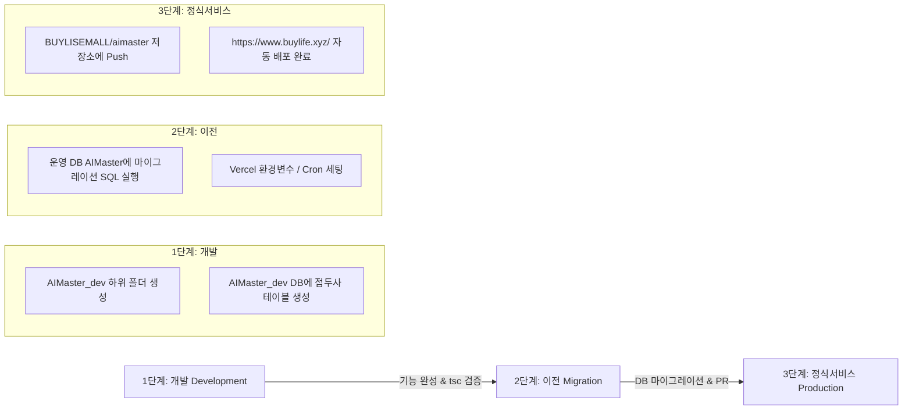

# AIMaster AI 자동화 프로그램 개발 ➔ 이전 ➔ 정식서비스 표준 워크플로우 지침

> **문서 버전**: v1.0.0  
> **적용 범위**: `AIMaster_dev` 환경에서 개발되는 모든 신규 AI 자동화 프로그램 및 기존 서비스  
> **핵심 타깃 서비스**: `https://www.buylife.xyz/` (GitHub: `BUYLISEMALL/aimaster`, Vercel 자동 배포)

---

## 🎯 1. 전체 개발 및 서비스 환경 정의

| 환경 구분 | 개발 및 R&D 환경 (Development) | 정식 운영 서비스 환경 (Production) |
| :--- | :--- | :--- |
| **로컬 경로** | `d:\Antigravity\AIMaster_dev\[프로그램명]\` | GitHub `BUYLISEMALL/aimaster` 프로젝트 |
| **Supabase DB** | **`AIMaster_dev`** (개발 전용 DB) | **`AIMaster`** (정식 서비스 운영 DB) |
| **서비스 URL** | `http://localhost:3000` (개발 서버) | `https://www.buylife.xyz/` (실제 실방용) |
| **핵심 역할** | 신규 AI 기능 독립 개발, 무제한 테스트, 실험 | 실사용자 대상 마케팅 자동화 정식 서비스 제공 |

---

## 🔄 2. 표준 3-단계 프로그램 수명주기 룰 (Lifecycle Rules)

앞으로 개발되는 모든 신규 AI 자동화 프로그램(블로그, SNS, 파트너스, 이메일 등)은 반드시 아래 **[개발 ➔ 이전 ➔ 정식서비스]** 3단계를 순차적으로 거쳐서 진행합니다.

---

### [1단계: 개발 (Development)]
1. **하위 폴더 독립 생성**: `d:\Antigravity\AIMaster_dev\[신규프로그램명]\` 디렉터리를 새로 생성하여 소스코드를 작성합니다.
2. **개발 DB 활용**: 반드시 Supabase 개발 프로젝트인 **`AIMaster_dev`**를 연동하여 데이터베이스를 구성합니다.
3. **접두사(Prefix) 규칙 준수**: 데이터베이스의 모든 개체(테이블, 인덱스, 함수, 정책 등)에는 프로그램명을 접두사로 사용합니다.
   - 예시: `blog_posts`, `sns_campaigns`, `coupang_products`
4. **로컬 테스트 검증**: TypeScript 컴파일 검사 (`npx tsc --noEmit`) 0 오류를 확인합니다.

---

### [2단계: 이전 (Migration)]
1. **DB 마이그레이션 스크립트 작성**:
   - 개발 DB(`AIMaster_dev`)에서 검증된 테이블 DDL 및 초기 설정 SQL을 파일(`migration.sql`)로 정돈합니다.
2. **운영 DB 스키마 적용**:
   - 정식 운영 Supabase 프로젝트인 **`AIMaster`**의 SQL Editor에서 작성된 SQL 마이그레이션을 실행합니다.
3. **환경 변수(Env) 맵핑**:
   - 정식 서비스의 Supabase URL 및 Key를 Vercel 프로젝트 대시보드(Environment Variables)에 설정합니다.

---

### [3단계: 정식서비스 반영 (Production Release)]
1. **소스 코드 통합**:
   - 완성된 프로그램 소스코드를 정식 서비스 저장소인 GitHub **`BUYLISEMALL/aimaster`**로 머지/커밋합니다.
2. **Vercel 자동 배포**:
   - `BUYLISEMALL/aimaster` 저장소의 `master` 브랜치에 Push되면, Vercel이 이를 인식하여 `https://www.buylife.xyz/` 로 100% 자동 빌드 및 실서버 배포를 완료합니다.
3. **백그라운드 스케줄러 배치 (필요시)**:
   - 무인 포스팅/수집 봇(`blog_auto_poster` 등)은 GitHub Actions 또는 Vercel Cron Jobs에 등록하여 정기 실행을 활성화합니다.

---

## 🗄️ 3. 데이터베이스 단일 통합 및 접두사 관리 테이블 표

| 서비스 구분 | 전용 DB 테이블 접두사(Prefix) | 수록 테이블 예시 |
| :--- | :--- | :--- |
| **DevFlow 블로그 서비스** | `blog_` | `blog_categories`, `blog_authors`, `blog_posts`, `blog_post_categories`, `blog_comments`, `blog_likes` |
| **SNS 마케팅 자동화 (신규)** | `sns_` | `sns_accounts`, `sns_posts`, `sns_logs` |
| **제휴 마케팅 자동화 (신규)** | `affiliate_` | `affiliate_products`, `affiliate_links` |

---

## 📋 4. 이관 체크리스트 (Migration Checklist)

정식 서비스 배포 전 아래 사항을 최종 체크리스트로 활용합니다:

- [ ] `npx tsc --noEmit` 검사를 통과하여 타입 에러가 0건인가?
- [ ] 테이블 및 인덱스명에 서비스 접두사(`[서비스명]_`)가 정확히 붙어 있는가?
- [ ] 운영 DB(`AIMaster`)에 DDL 마이그레이션 SQL 실행을 완료하였는가?
- [ ] GitHub `BUYLISEMALL/aimaster` 저장소로 코드 커밋이 완료되었는가?
- [ ] Vercel 배포 후 `https://www.buylife.xyz/` 에서 서비스 정상 작동을 확인하였는가?

---
*본 문서는 AIMaster AI 자동화 통합 플랫폼 개발 가이드라인으로 사용됩니다.*
