# 네이버 블로그 에이전트와 BLOG(원문)생성 자동화 비교

작성일: 2026-10-10. 비교 기준: `naver-blog-agent` v1.63와 `ai-auto-blog` v1.39. 주인님 요청에 따른 읽기 조사이며 기능 수정·유료 생성·네이버 최종 발행은 하지 않았습니다.

**판정:** 에이전트는 서버 대기열과 입력 검증을 중심으로 최종 발행까지 실행하는 구조입니다. BLOG는 뉴스 자료를 이용해 본문·이미지를 함께 생성하고, 회원이 사이드패널에서 입력을 시작한 뒤 마지막 발행을 직접 하는 구조입니다. 자동화 범위와 입력 기술이 다르며, 양쪽 모두 별도의 보완 항목이 있습니다.

## 1. 조사 범위와 확인 수준

- 현재 대화에서 수정한 프로그램은 네이버 블로그 에이전트입니다. 저장소 전체 자동화 프로그램을 전수 비교한 보고서는 아닙니다.
- 두 프로젝트의 AGENTS/README, 최신 인수인계, 생성·수집·저장·인증·작업 전달 API, 확장 manifest/background/입력 엔진, 버전·보관 정책을 읽었습니다.
- 실제 Chrome의 시험 회원 로그인 세션에서 BLOG 홈과 `/write/ai-form`을 확인했습니다. 화면 v1.39, 본문 모델 선택·나노바나나 이미지 모델·이미지 1~5장 안내·DB 즉시 등록 안내를 확인했습니다. 생성 버튼은 누르지 않았습니다.
- 운영 DB에서 두 프로그램의 `version`, `extension_version`, `extension_download_url`, `app_url`만 읽어 확인했습니다. 회원 비밀값은 조회하지 않았습니다.
- 양쪽 라이브 latest ZIP HTTP 200. BLOG `sidepanel.js/background.js/manifest.json`, 에이전트 `background.js/editor.js/writer.js/manifest.json`은 로컬 소스와 줄바꿈 정규화 후 일치했습니다.
- 에이전트 공개 버전 API HTTP 200, v1.63. BLOG 비로그인 홈은 로그인 화면으로 이동, 확장 글 목록 API는 401입니다. 해당 확장 목록 401의 실제 Cache-Control은 `public, max-age=0, must-revalidate`였습니다. 과거 글 CRUD의 no-store 검증을 모든 확장 API의 no-store 검증으로 확대하지 않습니다.
- 이번 재실행: 에이전트 `test:extension-tabs` 16개 및 `test:extension`, `test:publishing`, `test:edit-save` 통과. BLOG `test:security` 39개 통과. 실제 입력·최종 발행 E2E 검사는 이번에 하지 않았습니다.
- 추가로 실제 함수/route 코드를 VM에서 실행한 두 가지 결함 재현은 §7에 있습니다. 모의 DB만 사용했습니다.

라이브: [네이버 블로그 에이전트](https://naver-blog-agent.vercel.app), [BLOG](https://ai-auto-blog-one.vercel.app).

## 2. 동작 흐름

```mermaid
flowchart TD
  subgraph NBA[네이버 블로그 에이전트 v1.63]
    A1[회원이 주제와 모델 선택] --> A2[기획 → 본문 → 윤문 → 검수]
    A2 --> A3[이미지 프롬프트 → 별도 이미지 생성 API]
    A3 --> A4[로컬 보관과 서버 원고 저장]
    A4 --> A5[회원이 발행 대기 등록]
    A5 --> A6[확장 worker가 작업 1건 선점]
    A6 --> A7[본인 블로그와 빈 편집기 확인]
    A7 --> A8[입력 1단계 → 문서 확인 → 다음 단계]
    A8 --> A9[카테고리·태그·공개·예약 설정]
    A9 --> A10[최종 발행 → 게시글 또는 예약 목록 확인]
    A10 --> A11[결과 선보관 → 서버 결과 보고]
  end
  subgraph BLOG[BLOG v1.39]
    B1[회원이 주제와 모델 선택] --> B2[Google News RSS 자료 수집]
    B2 --> B3[선택 모델로 4개 섹션 JSON 생성]
    B3 --> B4[섹션 핵심 문장 선정 → Gemini 이미지 1~5장]
    B4 --> B5[이미지 배치 → HTML → 회원 DB 글 등록]
    B5 --> B6[회원이 네이버 입력기로 보내기]
    B6 --> B7[사이드패널에서 글 선택·이미지 미리 다운로드]
    B7 --> B8[회원이 입력 시작 → CDP 문자 입력·DOM 이미지 업로드]
    B8 --> B9[본문 포함 여부 확인·카테고리·태그 입력]
    B9 --> B10[회원이 네이버 마지막 발행 버튼 직접 클릭]
  end
```

BLOG의 원클릭 등록은 **BLOG 내부 `blog_posts`에 저장하고 `/posts/<id>`에서 조회할 수 있게 하는 작업**입니다. 네이버 최종 발행 완료를 뜻하지 않습니다. 에이전트도 글 생성과 발행 대기 등록은 구분되어 있습니다.

양쪽 모두 실제 네이버 입력에는 회원 PC의 Chrome·설치된 확장·네이버 로그인 세션이 필요합니다. Vercel에 사이트를 배포했다고 PC가 꺼진 상태에서 네이버 화면 입력까지 실행되는 구조는 아닙니다.

## 3. 사용 도구와 실행 위치

| 구분 | 네이버 블로그 에이전트 | BLOG |
|---|---|---|
| 웹 | Next.js 16.2.11·React 19.2.4·TypeScript·Tailwind | Next.js 16.2.10·React 19.2.4·TypeScript·Tailwind |
| 편집 | Tiptap 기반 스마트 편집기 | Tiptap 기반 편집기 및 생성 결과 블록 편집 |
| DB·회원 | 공용 Supabase, `nba_posts`·연결 토큰·회원별 설정 | 같은 Supabase, `blog_posts`·작성자·분류·개인 접근 토큰 |
| 이미지 저장 | `ai-image-generations` 버킷의 프로그램/회원 경로 | `post-images` 버킷의 회원/프로그램 경로 |
| 본문 AI 호출 | OpenAI·Claude·Gemini SDK, 역할별 순차 호출 | 직접 HTTP 어댑터, OpenAI Chat/Responses·Claude Messages·Gemini |
| 이미지 공급사 | Gemini·OpenAI·Replicate 경로가 코드에 존재 | 기본 자동 생성은 Gemini 나노바나나 |
| 네이버 실행 주체 | Manifest V3 service worker | 확장 사이드패널 문서의 JavaScript |
| 텍스트 입력 | `chrome.scripting` 주입 → 입력 iframe의 `execCommand` | `chrome.debugger` → CDP `Input.insertText`·Enter 키 이벤트 |
| 이미지 입력 | File·DataTransfer·file input change·반영 검증 | File·DataTransfer·file input 이벤트 + CDP 파일 선택창 가로채기 |
| 작업 시작 | worker 폴링·alarm·탭 이벤트 | 회원의 사이드패널 버튼 클릭 |
| 발행 | 확장이 최종 클릭·결과 확인 | 회원이 최종 클릭, 확장은 입력 준비까지만 |
| 보관 정리 | 매일 Cron `/api/cron/cleanup` | 매일 Cron `/api/cron/cleanup-images` |

관련 실행 경로와 package/manifest에서 Make·n8n·Selenium·Playwright가 네이버 입력 엔진으로 사용되는 연결은 확인되지 않았습니다. BLOG 화면의 MAKE/n8n은 글 분류 이름입니다. 자체 JavaScript로 구현한 자동화입니다. Orca·Git·Node 검사·Vercel CLI는 개발·검수·배포 도구이며 회원이 실행하는 입력 엔진과 구분합니다.

공급사와 모델 이름은 현재 저장소 구현을 설명한 것입니다. 목록 전체 모델의 공급사 지원 여부·유료 생성 성공률을 이번에 검증하지 않았습니다.

## 4. 본문·이미지 생성 방식

**에이전트:** 기획/본문/윤문/검수는 보통 네 번의 텍스트 AI 호출입니다. 역할 이름이 여러 에이전트여도 현재 구현은 선택한 공급사·모델에 서로 다른 프롬프트를 순서대로 보내는 구조입니다. LLM이 매 입력 단계의 마우스 위치를 판단하는 구조는 아닙니다. 다섯 번째 Image 단계는 이미지 프롬프트를 준비하며 실제 이미지는 웹의 `/api/generate-image`로 따로 생성합니다.

말끝·문체·페르소나·목표 글자 수를 전달하고, 연도 입력/프롬프트/출력 방어가 있습니다. 윤문은 잠긴 구조를 보호하고 숫자 변화를 검사합니다. Reviewer는 본문 전체와 글자 수를 보고 PASS/WARN/FAIL/UNKNOWN을 반환합니다. 다만 이 검토는 외부 자료로 사실을 독립 증명한 결과가 아닙니다. 이 생성 경로의 Research는 LLM 목차 기획이며 네트워크 검색을 자동 수행하지 않습니다. 별도 수집소에는 HTTP/RSS·Perplexity·YouTube 수집 코드가 있습니다.

**BLOG:** 생성 API가 주제로 Google News RSS를 가져와 최근 기사 제목·요약·링크를 AI 컨텍스트에 넣습니다. 이름은 24시간 수집이지만 실제 파서 허용 범위는 26시간입니다. 본문 모델 한 번으로 제목·요약·4개 소제목·4개 본문을 JSON으로 생성하고 Markdown/HTML로 조립합니다. 별도 윤문·검수 LLM 단계는 확인되지 않았습니다.

BLOG의 이미지 구성은 더 구체적입니다. 제목 대표 이미지 1장, 본문 4개를 남은 이미지 수에 맞춰 묶은 뒤 각 구간의 실제 문장 하나를 Gemini로 선정합니다. 그 문장이 원문에 포함됐는지 검사하고 영어 장면 프롬프트를 만듭니다. 잘못 고른 문장은 원문 문장으로 대체합니다. 이미지 생성·저장 실패 시 해당 칸을 비우고 글 생성은 계속합니다. 참고 URL은 본문 프롬프트에 문자열로 넣으며, 이 생성 경로에서 그 URL의 본문을 가져와 읽는 단계는 확인되지 않았습니다.

AI 비용은 에이전트가 텍스트 호출 횟수 측면에서 더 많을 수 있습니다. BLOG는 보통 본문 1회+이미지 장면 선정 1회+이미지 N회입니다. 실제 비용·시간은 모델/입출력 토큰/이미지 크기에 따라 달라 이번에 수치 비교하지 않았습니다. RSS 네트워크 비용이나 재시도도 별도로 고려해야 합니다.

근거: [에이전트 생성](../src/lib/ai/pipeline.ts), [본문 호출](../src/lib/ai/models.ts), [윤문 적용](../src/lib/humanizer/index.ts), [BLOG 생성](../../ai-auto-blog/utils/news/generator.ts), [뉴스 자료](../../ai-auto-blog/utils/news/collector.ts), [이미지 선정·생성](../../ai-auto-blog/utils/news/imageGenerator.ts).

## 5. 네이버 입력 기술·검증 차이

| 항목 | 에이전트 | BLOG |
|---|---|---|
| 대상 탭 | 연결 blogId의 편집기인지 확인 | 활성 네이버 탭 우선, 없으면 첫 네이버 탭 |
| 기존 내용 | 자동 발행 경로는 빈 편집기 요구, 이어쓰기 팝업 처리 | 제목 끝·빈 문단 또는 마지막 문단에 커서 설정, 빈 문서 강제 없음 |
| 타이핑 | 문장/덩어리 입력, 이모지는 grapheme 단위 분리 | 문자별 CDP 입력, 70~170ms 및 간헐적 대기 |
| 문서 변화 | 각 작업 전후 snapshot과 기대 prefix 비교 | 입력 후 제목·본문 문구 포함 여부 검사 |
| 이미지 검증 | URL 중복 제거·파일명·순서·개수·AI 활용 표시 | 업로드 후 이미지 개수 증가 검사, 실패 다운로드 이미지는 생략 |
| 본문 구조 | 제목 인용구·소제목 인용구·이미지 위치 검증 | HTML을 text/image/link 블록으로 변환, 글자 입력 중심 |
| 재시도 | 변화가 없다고 증명된 텍스트 작업만 제한 재시도, 이미지 재업로드 없음 | 회원이 다시 실행할 수 있으나 문서 prefix·진행 체크포인트 없음 |
| 태그 | 최대 10개, 실제 등록 칩·재적용 중복 확인 | 자체 최대 30개 허용, 입력창 비움으로 처리 여부 판정 |
| 카테고리 | 실제 목록 조회, ID와 이름 확인, 원고별 저장 | 패널의 카테고리 문자열, 이름 비교·부분 일치 후보 |
| 예약·공개 | 자동 설정 및 예약 목록/게시글 확인 코드 | 자동 함수는 카테고리·태그 입력까지만, 나머지는 회원 조작 |

에이전트의 안전성은 단순히 DOM을 쓰기 때문이 아니라 **입력 전후 상태 비교와 중지 조건**에서 나옵니다. BLOG의 CDP는 문자 입력과 Enter 이벤트를 브라우저에 전달하고 파일 선택창을 제어하는 장점이 있지만 debugger 권한과 연결이 필요하며 DevTools/다른 디버거 충돌을 처리해야 합니다. 둘 다 네이버 DOM 셀렉터·업로드 동작이 바뀌면 영향을 받습니다. 무작위 대기나 실제 Chrome 사용만으로 사이트의 자동화 탐지 여부를 보증할 수 없습니다.

근거: [worker](../extension/background.js), [작성 순서 엔진](../extension/writer.js), [편집기 명령](../extension/editor.js), [BLOG 사이드패널](../../ai-auto-blog/extension/sidepanel.js), [BLOG HTML 변환](../../ai-auto-blog/utils/extensionContent.ts). Chrome 기술 설명: [debugger API](https://developer.chrome.com/docs/extensions/reference/api/debugger), [scripting API](https://developer.chrome.com/docs/extensions/reference/api/scripting).

## 6. 작업 전달·복구·회원 분리

에이전트는 `draft → queued → publishing → published/failed` 상태를 사용합니다. 서버는 회원·blogId에 맞는 가장 오래된 queued 1건을 읽고 **아직 queued일 때만** publishing으로 바꿉니다. 동시에 두 확장이 가져가려 해도 선점에 성공한 쪽에만 작업을 반환합니다. worker는 깨어 있는 동안 10초 폴링, 30초 alarm 대체 경로를 사용합니다. 이는 정확한 10초 실행 보장이 아닙니다.

v1.63은 `activeTask/authoringCheckpoint/pendingResult`를 저장하고 탭 제거·교체를 처리합니다. 작성 중 worker 재시작은 자동 재입력하지 않고 중지하며 final 단계는 불확실 결과로 남깁니다. `writer.js`의 prefix 검사 능력이 있더라도 현재 정상 자동 발행 경로는 빈 편집기를 요구하므로 무중단 이어쓰기 보장으로 해석하지 않습니다. 예약 확인 성공은 예약 목록 등록 확인이며 미래 시각에 실제 게시됐다는 증거와 구분합니다.

BLOG의 보내기는 `extension_handoff_at`을 찍어 회원 글을 최근 20개 패널 목록에 올립니다. 작업 선점 대기열은 아닙니다. 두 PC/패널이 같은 글을 선택하는 것을 이 API에서 독점 방지하지 않습니다. 입력 상태는 in_progress/completed/publish_ready/failed이며 네이버 실제 발행 URL·발행 성공을 확정하는 상태가 아닙니다. 진행 원고는 패널 메모리에 있고 토큰·기본 카테고리/태그만 로컬 저장합니다. 패널 문서가 파괴·재로드되면 진행 보존/자동 복구를 기대할 수 없습니다. 단순히 패널을 잠깐 숨길 때 문서가 반드시 파괴되는지는 이번에 확인하지 않았습니다.

두 프로그램 모두 웹 회원 권한과 확장 토큰 소유자·회원 글 소유권을 확인하고 본인 AI 키를 사용합니다. BLOG는 DB에 개인 토큰의 SHA256 해시와 폐기 여부를 저장·검증합니다. 에이전트는 10분 페어링 코드로 교환한 토큰 원문을 `nba_extension_tokens`에 보관합니다. 해시 보관 패턴은 에이전트에서 재사용할 만합니다. 다만 BLOG 웹 회원과 실제 네이버 탭의 blogId를 묶어 확인하는 부분은 현재 에이전트보다 약합니다.

양쪽 Cron의 `0 18 * * *`는 매일 UTC 18시, 한국 시각 다음날 03시입니다. 이 Cron은 30일 보관 콘텐츠 정리이며 생성·네이버 입력 스케줄러가 아닙니다. 에이전트 수집 글감의 보관 표시는 정리 제외 원칙이 있습니다. 보관 정책 시작일은 BLOG 10/1, 에이전트 10/8로 기존 자료에 유예를 줍니다.

Chrome worker는 종료될 수 있으므로 전역 변수만으로 작업을 복구할 수 없습니다. [Chrome worker 수명주기 문서](https://developer.chrome.com/docs/extensions/develop/concepts/service-workers/lifecycle)도 상태 저장과 예상치 못한 종료 대비를 설명합니다.

## 7. 확인된 결함과 보완 우선순위 — 모두 이번에는 미수정

**우선 1: 에이전트 결과 보고의 잘못된 성공 응답 — 실제 route 모의 재현.**

`src/app/api/extension/finish/route.ts`는 Supabase update의 반환 `error`와 반영된 행을 확인하지 않고 success 응답을 보냅니다. 실제 route를 TypeScript 변환 후 VM에서 실행하고 DB update가 `{data:null,error:{message:'SIMULATED_DATABASE_FAILURE'}}`를 반환하게 했습니다. 응답은 HTTP 200, `success:true`, 정상 반영 메시지였습니다.

확장은 이 응답을 성공으로 보고 `pendingResult/activeTask`를 제거할 수 있습니다. v1.63의 네트워크 실패 재보고 보완은 HTTP 성공으로 위장된 DB 실패까지 방어하지 못합니다. 서버가 DB 오류·0행을 구분하고 실제 반영을 확인한 후 ACK해야 합니다. 작업 버전/소유자/단계 조건과 멱등 결과 보고도 함께 검토합니다. 운영 DB 실패를 발생시킨 시험은 하지 않았습니다.

**우선 1: BLOG의 대상 계정·빈 문서·중복 입력 확인 부족 — 코드 확인 및 실제 검증 함수 모의 재현.**

`getNaverBlogTab()`은 대상 회원 blogId 확인 없이 네이버 탭을 선택하며 `focusNaverEditor()`는 기존 제목 끝에 커서를 놓습니다. 실제 `verifyNaverEditorContent()`를 VM에서 실행해 제목 `old title NEW_TITLE`, 본문 `P1 P2 P1 P2`, 기대 제목 `NEW_TITLE`, 기대 본문 `[P1,P2]`를 넣었더니 `ok:true`, `missingCount:0`이었습니다. 기존 내용 혼합·중복·순서 오류를 포함 검사로는 막을 수 없습니다. 본인 blogId·빈 문서 사전 확인과 단계별 정확한 구조 비교가 필요합니다.

**우선 1: BLOG 입력 중 선택 변경 위험 — 코드 확인, GUI 재현 미실행.**

`fillPostIntoNaver()`는 두 입력 버튼만 잠그고 `postList/refreshPosts`는 잠그지 않습니다. 로딩·입력·검증·결과 보고가 바뀔 수 있는 전역 `active`를 참조합니다. 입력 도중 다른 글 선택/목록 새로고침을 하면 제목·본문·보고 대상 ID가 서로 달라질 위험이 있습니다. 시작 시 불변 원고·탭·회원 스냅샷을 고정하고 선택·연결 변경을 잠가야 합니다. 서버 선점 또는 실행 ID도 필요합니다.

**우선 2: BLOG 결과 보고 통신 실패 은폐 — 코드 확인.**

`reportInputResult()`는 `.catch(()=>{})`로 실패를 버립니다. 화면 입력 성공과 DB 상태 기록이 달라도 알 수 없고 재보고 저장도 없습니다. 입력 결과와 보고 결과를 분리하고 pending outcome을 저장해 보고만 재시도하는 에이전트 패턴이 적합합니다.

**우선 2: BLOG의 모든 프레임에서 실행하는 이미지 변경 — 코드 확인, 현재 중복 업로드 재현 미실행.**

추천 링크는 v1.27에서 단일 frameId로 보완됐지만 이미지 버튼 클릭·file input 할당은 아직 `allFrames:true`입니다. 해당 제어 요소를 가진 프레임이 여러 개면 변경 명령이 여러 번 실행될 수 있습니다. 읽기 탐색 후 변경은 확인된 프레임 한 곳에서 실행해야 합니다. 이미지 이름도 모두 `blog-image.<ext>`여서 에이전트처럼 단계별 자산을 구분하기 어렵습니다. AI 활용 표시를 설정·검증하는 에이전트 기능도 BLOG 실행 경로에서 확인되지 않았습니다.

**우선 2: BLOG의 콘텐츠 기준 연도·목표 길이 — 코드 확인.**

본문 생성 프롬프트에 동적 `currentYear` 주입·출력 연도 방어가 확인되지 않았습니다. 화면 예시에 2026이 있어도 임의 주제의 본문을 2026 기준으로 보장하지 못합니다. 또 화면은 목표 글자수 2,000자로 표시하지만 `target_word_count:2000`을 보내고 서버는 `wordCount=2000`으로 받아 프롬프트에 약 2,000단어/공백 제외 약 7,000자 이상을 지시합니다. 입력 단위·허용 범위·실제 결과 길이를 통일해야 합니다.

**우선 2: BLOG 뉴스 지표의 의미 — 코드 확인.**

`socialMentionScore = min(100,max(50,출처수*12+30))`이며 SNS 언급량 조회가 아닙니다. 노출 점수는 기사 개수, 영향 점수는 특정 단어 포함 비율입니다. 기사 0개 때도 모두 50을 반환합니다. 내부 추정 점수임을 명시하고 데이터 없음은 없음으로 보여줘야 합니다. 뉴스 RSS 제목·요약을 읽은 것을 기사 본문 사실 검증이나 검색 순위/실제 SNS 성과 분석으로 설명하지 않습니다.

**우선 2: 에이전트의 이미지 장수 설정과 자동 실행 불일치 — 코드 확인.**

현재 pipeline은 실제로 대표·본문 프롬프트 두 개를 반환합니다. 웹은 `min(imageSettings.count,max(prompts.length,1))`로 자동 생성 장수를 정합니다. 따라서 새 글 자동 생성에서 4장을 골라도 현재 이 경로는 최대 두 장입니다. 이후 개별 이미지 추가로 네 장을 만들 수 있었던 기존 검수와 구분합니다. BLOG의 구간 분할 계획을 재사용해 선택 장수대로 서로 다른 본문 장면을 만드는 개선이 적합합니다.

**우선 2: 에이전트의 기획·검수 보증 범위 — 코드 확인.**

- pipeline의 `recentTitles` 중복 방지 입력은 기본값 []이며 현재 `/api/generate`는 최근 제목을 조회·전달하지 않습니다. 프롬프트 문구만으로 최근 원고 중복 방지를 보증하지 못합니다.
- `reviewStatus`는 반환되지만 현재 원고 저장·대기·발행 경로에서 FAIL/UNKNOWN을 강제 차단하는 연결이 확인되지 않았습니다. 저장·전달 중 검수 메타데이터 보존과 승인 기준이 필요합니다.
- 윤문 `extractSignatures()`는 숫자와 URL을 추출하지만 적용 단계는 숫자 배열만 비교합니다. URL 보존을 완전히 검증한다고 설명하지 않습니다. 실제 사실 검증도 숫자 동일성만으로는 증명되지 않습니다.
- OpenAI 본문 어댑터는 모든 선택 모델에 temperature 0.7을 전송합니다. BLOG의 모델별 파라미터/엔드포인트 분기와 달라 선택 모델의 공식 지원 옵션을 확인해 맞출 필요가 있습니다. 이번에 모델 오류를 유료 호출로 재현한 것은 아닙니다.

**우선 2: 에이전트 진행 관측·작업 인계 공백 — 코드 확인.**

worker의 `/progress`, `/stage`, `/waiting`, `/heartbeat` 어댑터는 현재 빈 객체를 반환하는 경로입니다. 일부 서버 상태 요청과 task 폴링이 last_ping_at을 갱신하지만 작성 단계·로그인 대기 상세가 서버에 모두 전달되는 구조는 아닙니다. `queued→publishing` 선점 뒤 응답 유실/PC 단절/로컬 작업 기록 상실 시 실행 ID·임대/복구 확인 경로가 충분한지도 보완해야 합니다. 무조건 queued로 되돌리는 방식은 이미 발행됐을 수 있어 중복 위험이 있습니다.

**기존 별도 후속 항목:** 에이전트 개별 이미지 추가/삭제 자동 저장, 저장 성공과 무관한 배지, 임시 ID→서버 UUID 전환 중 중복 저장 가능성은 앞선 인수인계에도 남아 있습니다. 이번 비교에서 해결한 것으로 표시하지 않습니다.

## 8. 재사용 방향

에이전트의 입력 순서·검증·탭 수명주기·결과 보존을 공통 실행 코어로 삼고, BLOG의 핵심 문장 기반 이미지 선정·선택 장수별 배치·명시적인 회원 최종 발행 흐름을 선택 기능으로 결합하는 방향이 적합합니다.

다만 기존 코드를 통째로 복사하면 위 결함도 전달됩니다. 우선 결과 ACK·대상 계정·불변 작업 ID·중복/정확성 검사부터 고친 다음 공통 모듈로 추출합니다. BLOG의 사람 확인 후 발행과 에이전트의 자동 발행은 별도 실행 옵션으로 유지하고, 본인 계정·API 규칙을 공통으로 적용합니다. CDP/DOM은 교체 가능한 입력 어댑터로 비교 검수하며 자동화 수준·성공 기준을 공유합니다.

이 판단은 현재 코드·모의 검사·일부 실제 화면·라이브 자산 확인에 근거합니다. 입력 기술별 실제 성공률·속도·사이트 탐지율·네이버 최종 발행 성공률의 실측 우열은 이번 자료로 결론 내리지 않습니다.

## 9. 다음 작업자와 릴리스 범위

이번 작업은 분석 문서와 인수인계 갱신만 합니다. 프로그램·DB·확장·운영 버전은 에이전트 v1.63/BLOG v1.39를 유지하며 새 기능 배포를 했다고 보고하지 않습니다.

후속 코드 수정 시 우선 1 항목을 먼저 처리하고 모의 실패/0행/중복/작업 선택 경쟁 검사를 추가합니다. 실제 검수는 회원 본인 계정의 별도 빈 네이버 편집기를 이용하며 최종 발행은 별도 승인 범위를 따릅니다. 배포가 필요한 코드 변경은 해당 프로그램의 다음 마이너 버전·manifest/ZIP/DB·빌드·검수·커밋/푸시·운영 배포·라이브 확인을 함께 진행합니다. 이전 v1.63 완료 기록은 당시 수정·검수 범위의 기록이며 본 보고서에서 새로 찾은 서버/생성 항목의 해결 증거가 아닙니다.
