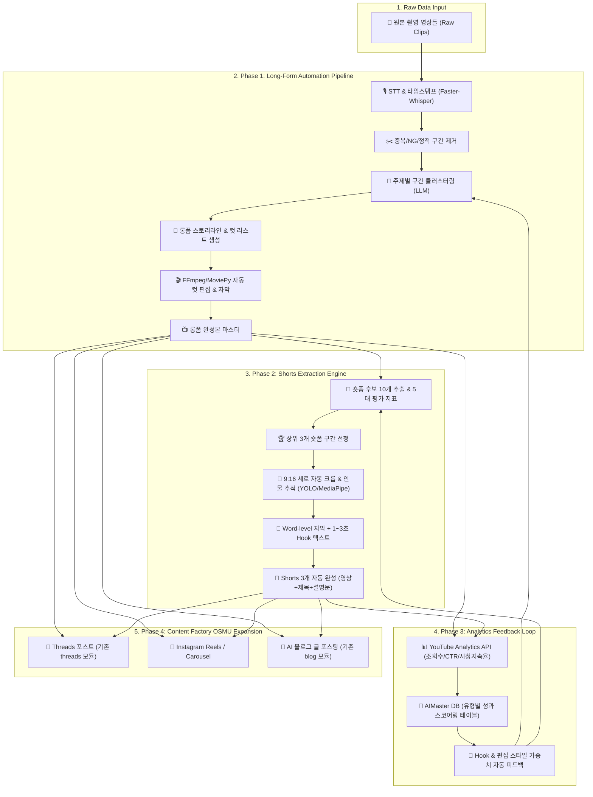

# 🏗️ AIMaster Shorts — 전체 시스템 아키텍처 명세서 (ARCHITECTURE.md)

## 1. 아키텍처 다이어그램 (Architecture Diagram)



---

## 2. 모듈별 동작 알고리즘 및 기술 스택

### 2.1 STT & 타임스탬프 파서 (STT Parser)
* **엔진**: `Faster-Whisper` (GPU VRAM 가속 및 CTranslate2 최적화 사용)
* **데이터 구조**:
  ```typescript
  interface WordTimestamp {
    word: string;
    start: number; // seconds
    end: number;   // seconds
    probability: number;
  }

  interface Segment {
    id: number;
    start: number;
    end: number;
    text: string;
    words: WordTimestamp[];
  }
  ```

### 2.2 LLM 숏폼 후보 추출 & 5대 지표 스코어링 (Scorer)
* **프롬프트 평가 지표**:
  1. `Hook Score` (0~100): 시청 초반 호기심/충격 유발도
  2. `Information Density` (0~100): 밀도 높은 지식/재미 전달력
  3. `Independence` (0~100): 앞뒤 문맥 없이 독립 시청 가능 여부
  4. `Emotion/Twist` (0~100): 서스펜스, 공감, 반전 요소
  5. `Completion Potential` (0~100): 끝까지 보거나 루프(Loop) 재생 유도율
* **출력 구조**:
  ```json
  {
    "candidates": [
      {
        "rank": 1,
        "start_time": "02:15.500",
        "end_time": "03:05.200",
        "duration": 49.7,
        "total_score": 92.5,
        "hook_title": "💡 99%가 틀리는 영상 편집 꿀팁",
        "reason": "초반 강력한 문제 제기와 명확한 해결책 제공"
      }
    ]
  }
  ```

### 2.3 9:16 인물 추적 세로 크롭 (Smart Reframing)
* **기술**: `MediaPipe Face Detection` / `YOLOv8`
* **동작 방식**:
  1. 프레임별 인물 Bounding Box `(x_center, y_center, w, h)` 감지.
  2. 이동 평균(Moving Average) 알고리즘으로 카메라 쉐이킹 방지 및 부드러운 중앙 추적 (Smooth Interpolation).
  3. 16:9 ➔ 9:16 비율 크롭 및 1080x1920 HD 렌더링.

### 2.4 YouTube Analytics API 피드백 루프 (Feedback Engine)
* **수집 주기**: 업로드 24시간, 7일, 30일 후
* **주요 지표**: Views, CTR, Average View Duration, Percentage Viewed, Subscriber Gains
* **학습 알고리즘**: 성과 상위 10% 숏폼의 훅 유형 및 발화 템포 패턴을 추출하여 LLM Few-shot 프롬프트 가중치를 동적으로 갱신.
