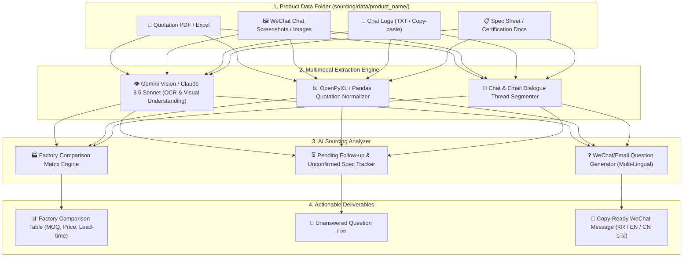

# 🏗️ Sourcing Agent — 상세 아키텍처 및 파이프라인 명세서 (ARCHITECTURE.md)

## 1. 전체 데이터 흐름 다이어그램 (Pipeline Architecture)



---

## 2. 모듈별 세부 알고리즘 및 데이터 스키마

### 2.1 공장별 소싱 비교 스키마 (Factory Matrix Schema)
```typescript
interface FactoryQuotation {
  factory_name: string;          // 예: Dongguan Precision Tech
  contact_person?: string;        // 예: Manager Wang
  contact_channel: 'wechat' | 'email' | 'alibaba';
  product_name: string;
  moq: number;                    // 예: 1000 Pcs
  unit_price: {
    currency: 'USD' | 'RMB' | 'KRW';
    price_exw?: number;
    price_fob?: number;
    tiered_prices?: Array<{ min_qty: number; price: number }>;
  };
  sample_info: {
    sample_fee: number;
    sample_lead_time_days: number;
    mould_fee?: number;
  };
  mass_production_lead_time_days: number; // 생산 소요 기간
  payment_terms: string;          // 예: "30% Deposit, 70% Before Shipment"
  last_updated: string;           // YYYY-MM-DD
}

interface SourcingAnalysisReport {
  product_name: string;
  factories: FactoryQuotation[];
  unconfirmed_specs: string[];    // 인증, 포장, 로고인쇄 등 미확인 항목
  pending_followups: Array<{      // 요청했지만 답변 안 온 항목
    date: string;
    factory_name: string;
    question_asked: string;
    status: 'unanswered';
  }>;
  next_questions: Array<{         // 다음에 물어볼 질문
    target_factory: string;
    question_kr: string;
    question_en: string;
    question_cn: string;
  }>;
}
```

### 2.2 위챗 대화 & 견적서 멀티모달 분석 프롬프트 (Extraction Prompt)
* **비전 & 텍스트 LLM 프롬프트**:
  ```text
  당신은 수석 해외 소싱 & 공급망(Supply Chain) 관리 전문가입니다.
  제공된 견적서 문서(PDF/Excel) 및 위챗 대화 캡처/텍스트 파일들을 통합 분석하여 다음을 JSON으로 추출하세요:

  1. 공장별 MOQ, 단가(통화 구분), 샘플비/금형비, 양산 리드타임, 결제 조건.
  2. 사용자가 과거 대화에서 질문했으나 공장에서 아직 답변하지 않은 미결 항목.
  3. 제품 스펙 중 확인되지 않은 사항(인증, 개별포장, 로고 인쇄 등).
  4. 단가 협상(네고) 및 확인을 위해 공장에 전달할 3가지 핵심 질문 (한국어, 영어, 중국어 🇨🇳 동시 작성).
  ```

---

## 3. 착한 마진 & 소싱 원가 계산기 (Landed Cost Formula)

```
[착한 마진 수식]
최종 수입 단가 (Landed Cost) = (제품 FOB 단가 * 환율) + (관세 + 부가세) + (해상/항공 운송비 / 총수량) + 국내 창고 입고비

최종 공헌이익 = 판매가 - (최종 수입 단가 + 쿠팡/네이버 수수료 + 택배비 + 마케팅비)
```
